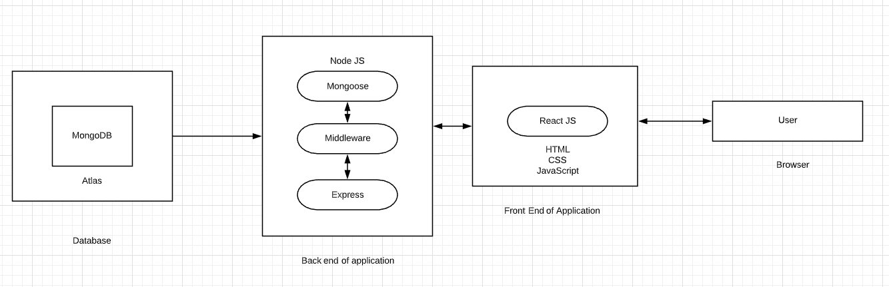
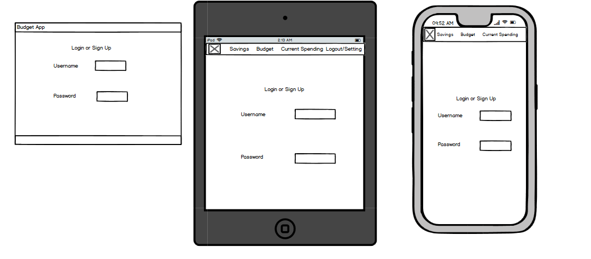
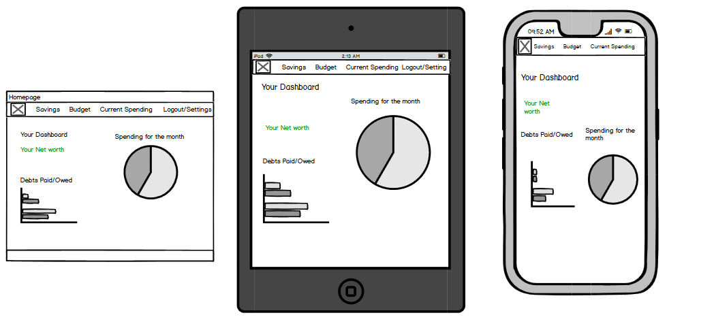
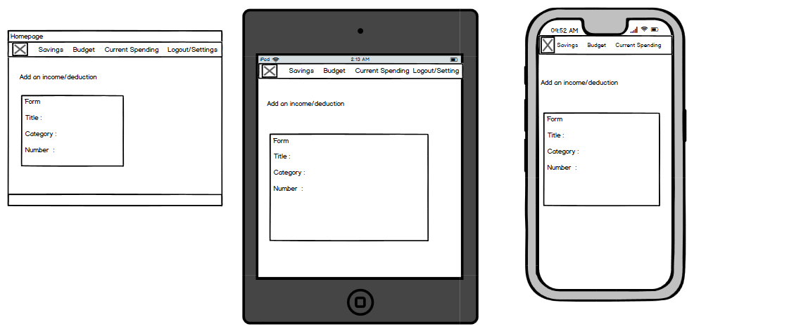
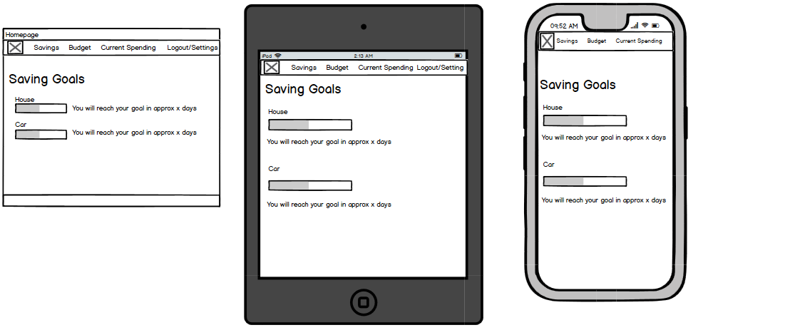
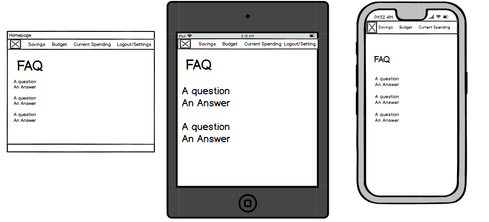

## Full Stack Application 
https://serene-kepler-9fd735.netlify.app/ deployed app
 
 backend repo: https://github.com/MartinVald2170/budget_backend  
 front end repo: https://github.com/MartinVald2170/budget_frontend

### - Purpose
### - Functionality / features
### - Target audience
### - Tech stack
### - Libraries Used 
### - How to Run 
##### - Purpose
The purpose of the budgeting tool is to provide users a simple solution for managing their finances. Often budgeting apps require setting up several integrations & categorising every single expense line item into a whole range of different expense types, which then leads to people seeing budgeting as a burden, as opposed to a handy tool. We don’t believe that people should be made to feel guilty for spending money, but should be able to have a great macro view of their overall finances at the same time.

We aim to provide essential functionality, stripped down so that users can have a simple and intuitive overview of their personal finances. This includes not only a weekly/monthly budget, but also any debt they’re currently paying off, as well as an investment projection calculator.

##### - Functionality / features
- Users will be able to log in and log out
- The main home page will be a dashboard where users can see different high level reflections and some calculations of their financial position. We’ll have 3 different graphs displayed on the main page 1) an overall budget breakdown (being the core functionality/product) 2) a graph letting users know how long until they pay their debt off (and ultimate interest accrual) and 3) a projection on their investments for a 10 year period based on their investment/savings rate in their budget.
- We’ll have the budget on a separate tab (main functionality). Users will be able to add in the different elements of their budget divided up into 4 different categories - fixed bills, savings, investments, spending money (ie. the leftovers). The ‘budget’ is equivalent to their weekly/monthly income. The method generally involves splitting funds across several different bank accounts when income is received, to simplify the management of funds. There will be a form where users can add and deduct fixed bills or income as their personal circumstances change, which then acts as a guide on where to distribute income once it’s received. This will generate a pie chart with a clear breakdown around the budget make up.
- As a separate component, we will have a debt tracker. This will enable users to see how much debt they have, input their repayments, and it will tell them how long it’s going to take them to pay off and how much interest they will have paid by the end.
- As another separate component, we’ll have an investment forecaster. It will take an initial investment amount, as well as using the weekly/monthly contribution to investments from the budget tracker. This will create a forecast based on an industry standard growth rate to render a bar graph that will show growth in investments over a 10 year horizon.
- An FAQ - it will explain the 40/30/20/10 rule and how this style of budgeting works. How to use the tool appropriately and why we do it like this vs line item tracking.
- Global market indices into the nav bar or the footer, so people can have a snapshot for what’s currently happening around the world (data fetched from an api)
- An SMS service to remind users that it’s their pay day, and to go ahead and distribute the money to the various bank accounts to follow the amounts shown in the budget.

##### - Target audience
The app is aimed at a younger generation of people (< 35 years old) who are comfortable using digital tools in their daily life. I don’t expect it to be more popular with men or with women, but it seeks to differentiate itself from other apps due to its ‘lite’ functionality and limited ongoing up-keep. Someone only needs to review your situation when there are any circumstance changes. We consider this app to be a budget planner, more so than a budget tracker.

##### - Tech stack
- React on the front end
- Rails on the backend 
- Bootstrap for styling
- Heroku for Rails API deployment and Netifly for Front End App Deployment

##### - Libraries Used 
- axios - A library which allows http requests towards a site 
- react bootstrap - A library which allows boostrap styling within a react app 
- react-router-dom to allowing linking

##### - How to use 
Backed 
- git clone backend repo 
- cd into folder
- rails bundle install
- rails db:create
- rails db:migrate
- rails db:seed
- rails s    
Frond end
- git clone frontend repo 
- cd into folder 
- yarn install or npm install
- yarn start 
- type y when prompt to run the server on port 30001
- go to localhost:3001

### R2 - Dataflow Diagram
 

### R3 - Application Architecture Diagram

### R4 - User Stories

#### Ease of Use 

- As a user I would like be able to find the use of this web app to be easy and smooth  
- As a user I would like to find it easy to search for answers on how to use the web app  
- As a user I would like to be able to see my statistics and goals easily 

#### User Management 
- As a user I want to be able to sign nup and create a profile to start budgeting  
- As a user I want to login with an email and password  
- As a user I to be able to logout with one click

#### Budgeting 
- As a user I want to have easy to read visualisations of my data  
- As a user I want to view my saving goals and how long it will take to reach it  
- As a user I would like to see my monthly budget   
- As a user I want to be able to see how much debt I have paid off and how much is left  
- As a user I want to be able to input my expenses and profits  
- As a user I want to be able to see my overall net worth 

#### Stocks
- As a user I want to see how my stock prices are doing 

### R5 - Wireframes for multiple standard screen sizes, created using industry standard software

Login Page

Dashboard 

Adding Form

Checking Savings

Faq Page

### R6 - Screenshots of your Trello board demonstrating use throughout the initial stages of the project

